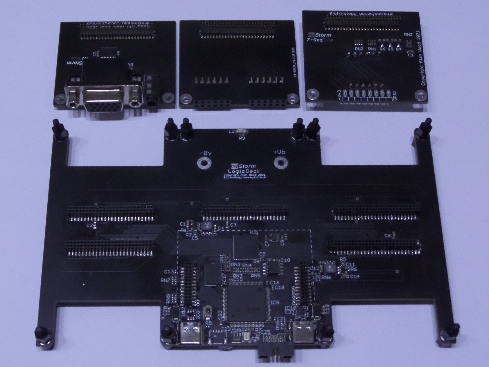
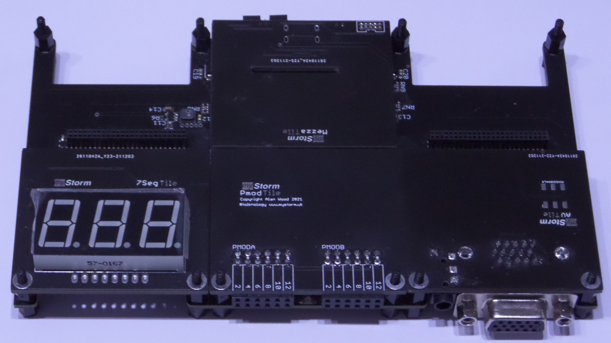
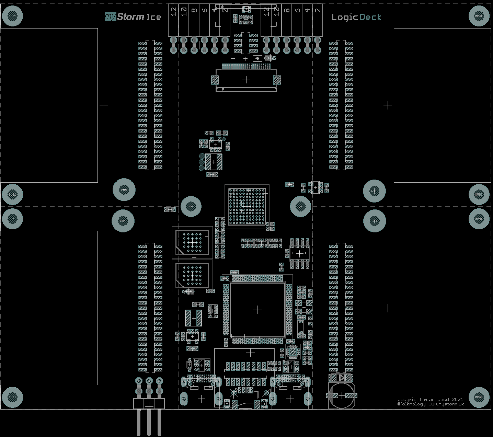
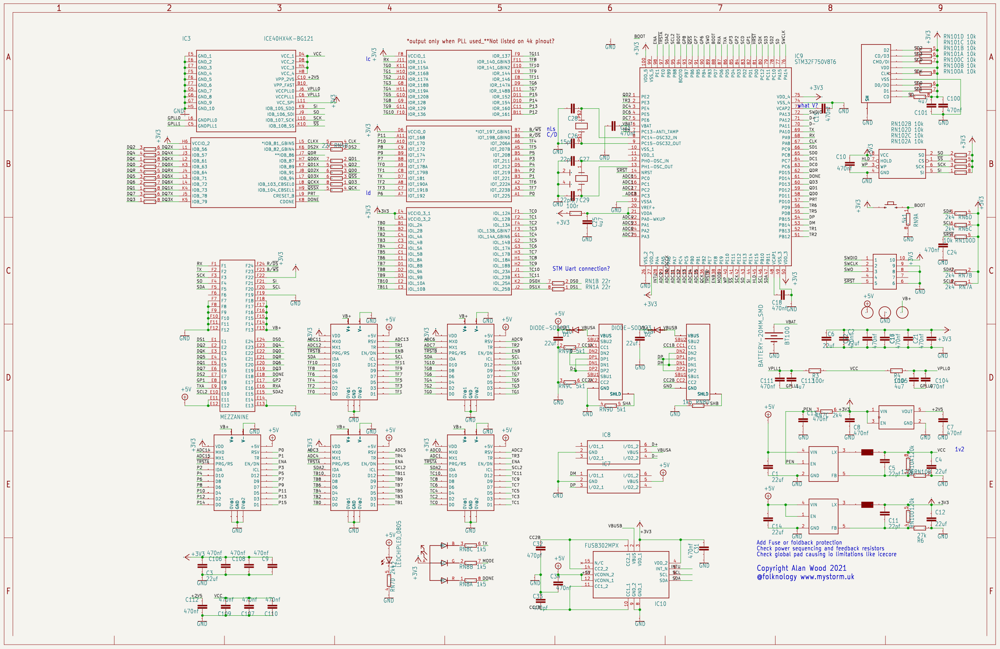

# Ice LogicDeck 
The very first myStorm [Tile](https://github.com/folknology/Tiles) based logic deck, designed around the combination of a powerful STM32 F7 microcontroller fused with a fully configurable Lattice Ice40Hx FPGA.
This forms a modular, heterogeneous embedded development system, it is very much WIP. We will add more documentation soon, you can follow the [live](https://www.twitch.tv/folknology) streaming [narrative](https://www.youtube.com/playlist?list=PLXS9jyX9czzqn4HU2mEmoEFxpgIv1Dvy7) as we develop it, you can follow the evolving [documentation](https://folknology.github.io/myStorm-Ice-LogicDeck/).

## The 'Deck' based solution is formed by combining multiple [Tiles](https://github.com/folknology/Tiles) and the Ice Logic board carrier

## Together these form an Ice LogicDeck solution

### Hardware, development, tooling and software
- [Hardware sources](https://github.com/folknology/myStorm-Ice-LogicDeck/tree/main/Hardware)
- [Firmware sources](https://github.com/folknology/BlackCrab)
- [Examples & board support](https://github.com/folknology/myStorm-Ice-LogicDeck/tree/main/HDL)
- [FPGA Synthesis, PNR and formal - Yosys OSS cad suite](https://github.com/YosysHQ/oss-cad-suite-build)
- [Simulation - Verilator](https://github.com/verilator/verilator)

### Further information
- [Tiles](https://github.com/folknology/Tiles)
- [Documentation](https://folknology.github.io/myStorm-Ice-LogicDeck/)
- [Discuss LogicDecks on Discord](https://discord.gg/RCGcgbQNZK)

### OpenSource Design

